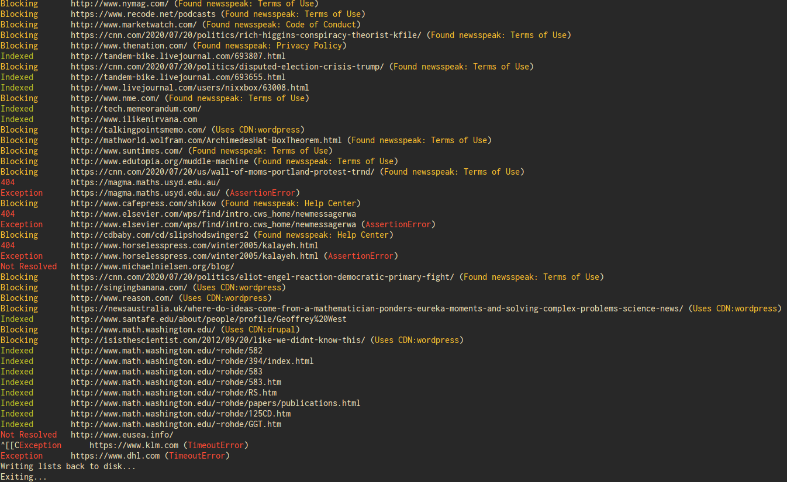

The internet today has become such a commercial place. You have corporate landing pages, huge conglomerate news sites, monopolistic social media sites and misleading clickbait sites meant to generate revenue through affiliate marketing. Personal websites and blogs, which might be some of the most original and genuine content you can find, are often buried or not shown at all. (Contrary to popular belief, Google doens't actually have 6 million results for every search query. They only have about 200 hits after which results start repeating, most of these being commercial pages.)

Itsie tries to crawl the web while categorically avioding such commercial pages. Along with an explicit blacklist, itsie also has the ability to recognize and block new commercial sites it comes across, whether it be another listicle site or a random bank's landing page. It also comes with a convenient PHP web front-end that can be easily served, and which acts like any other search engine.



## Installation and Usage

### Setting up MySQL

*Note: You don't need to know anything about MySQL. Once you have installed it from your repositories, it's just a matter of copy-pasting.*

- [Install MySQL](https://dev.mysql.com/doc/mysql-installation-excerpt/5.7/en/) for your distribution/OS
- Make sure it is installed: `mysql --version`
- Enable/start the MySQL Server. Usually `systemctl start mariadb` or `systemctl start mysql`
- Log in to MySQL as root: `sudo mysql -u root -p`. Press enter when prompted for password
- Make a new user, create a database, and give the new user rights to the database. **Important:** Use the _exact_ same credentials. Copy-paste.
```mysql
CREATE USER 'itsie'@'localhost' IDENTIFIED BY 'PaSSwoRd';
CREATE DATABASE search_index;
GRANT ALL PRIVILEGES ON search_index.* TO 'pycrawl'@'localhost';
FLUSH PRIVILEGES;
quit
```
- Now login as the new user: `mysql -u pycrawl -p`. Type in `PaSSwoRd` when prompted for password.
- Create a table in the new database to add indexed results:
```mysql
USE search_index;
CREATE TABLE search_index (
	id INT UNSIGNED AUTO_INCREMENT NOT NULL PRIMARY KEY,
	url VARCHAR(200),
	title VARCHAR(200),
	body TEXT,
	FULLTEXT (url,title,body)
	);
```

### Using the Crawler

Clone and install using `pip`:

```bash
git clone "https://github.com/nerdynewt/itsie"
pip install -e itsie
```

Make a directory to store some crawl metadata, an initialize the directory. Alternatively, you can also try the already initialized `example` folder in the project root.

```bash
mkdir mycrawl && cd mycrawl
itsie --init
```

Now you can place a list of urls (one per line) to crawl in `todo.txt`. Optionally, you can edit `exclude.txt`, which is an explicit list of websites (actually, regular expressions) that will be ignored. You don't have to worry about the rest of the files.

Run the `itsie`, specifying the depth to crawl upto. The default is 3:

```bash
itsie --depth 2
```

You can terminate the program any time by supplying a `KeyboardInterrupt`. Both the urls left to be crawled, and the new urls found, would be populated inside `todo.txt`.

### Using the web frontend

Itsie comes with a simple `PHP` document that provides a simple website and also does the database fetching. You have to set up `php` first, if you haven't:

- Install `php`
- [Set up](https://wiki.archlinux.org/index.php/PHP#MySQL/MariaDB) `php` to be used with MySQL

Now, go to the `site` folder and start a development `php` server:

```bash
cd itsie/site
php -S 0.0.0.0:8000
```

Now, navigate to <http://localhost:8000/>, and type in your search queries!

If you have done it before, you can also deploy this using a server of choice. Simply place `index.php` in your server root folder, and set up the server for `php`, `MySQL`, reverse-proxy, SSL, etc.

## Features

Itsie makes broad sweeping generalizations and assumptions on the present state of the internet and the needs of the user. So these aren't bugs, these are features:

### Blocklists

- *Completely ignores links to popular sites*: Big-business sites like Google, Facebook, YouTube, Twitter, etc are explicity ignored through a blocklist. Such links won't even be traversed.
- *Ignores News Sites*: Similarly, the blocklist also contains mainstream news sites like theguardian, nytimes, huffpost, etc.
- *Ignores _some_ listicle sites*: Same as above, think techcrunch, buzzfeed, etc

Of course, these can be bypassed by editing the blocklist as will be described, but that's not the intent. Traversing these sites would increase the crawl-list significantly without adding much original content. Also, this would be a fool's errand, as these sites are already indexed and served first-page by Google. If, however you _really_ want results from these sites, please use [this](https://google.com) search engine instead.

### More Important Features

- **Detects WordPress sites**: Simple WYSIWYG website generators like WordPress, Drupal, ASP.NET and Squarespace reduce the barrier for entry and therefore tends to produce bottom-of-the-barrel low-effort content mainly geared towards gaining the search system (muh SEO) and exploiting it for making money through ads and affiliate marketing. The CMS will be detected from the HTML header and if the site runs on such technologies, the domain will be put on a blacklist and ignored from then on.
- **Detects Corporate Landing Pages**: A good chunk of your crawl results will be the landing page to some random HR firm or a bank. Thankfully, such sites are practically carbon copies of each other. The crawler looks for common corporate buzzwords like "Privacy Policy", "Code of Conduct" or "Terms of Service" in the footer and adds these sites to a blocklist to be ignored.
- **No Traverse Loops**: The crawler visits the same domain only 15 times in total. So no loops.
- **Asynchronous Fetching**: Websites are fetched concurrently, and the time between server request and server response are not wasted.

## Configuration

As of now, the script uses these files:

- `todo.txt`: List of urls to be crawled, will be automatically populated with new urls after each iteration
- `excludes.txt`: This is a list of regular expressions. Any link matching these will be ignored. By default, this file contains some popular sites, non-html links and ad/tracking/cdn subdomains. You can add sites you don't like here.
- `sinners.txt`: You don't have to edit this. This file is populated whenever the crawler encounters a website running on CMS-driven sites
- `corporates.txt`: A list of detected corporate landing pages. Again, you don't have to edit this, this is read from and written to automatically.
- `seen.txt`: A list of urls that have already been crawled
- `domains.txt`: A list of _domains_ that have already been crawled

## Similar Projects

Although this is a Sunday-evening hackjob, there are a couple other projects that work similarly and are more fleshed out:

- [wiby](https://wiby.me): This is a simple website for the 'old web'. Only select websites chosen by the author are indexed, and they should agree to strict design guidelines (no flashy css, no javascript).
- [YaCy](https://yacy.net): This is a promising project and seeks to set up a decentralized network of crawlers and index-servers, which can be queried on search-time. However, in spite of the size of the network, the results are a bit lacking. Also, the project seems badly bloated, and is written in java with apparently only a confusing web-interface.

## Todo

- [ ] API for remote querying of indexed results, eventually a decentralized network of Itsies
- [ ] Deal with languages other than English
- [ ] Better website with nice HTML and CSS
